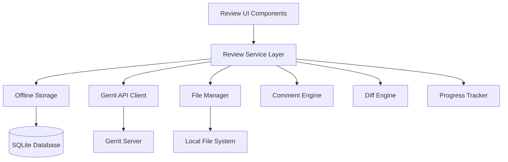

# Design Document: Gerrit Change Review System

## Overview

This document outlines the design for a comprehensive Gerrit change review system that supports both offline and online review modes. The system will provide an intuitive interface for reviewing code changes, managing comments, and submitting reviews to Gerrit servers.

## Architecture

### High-Level Architecture



### Component Responsibilities

- **Review UI Components**: React components for change selection, file navigation, diff viewing, and comment management
- **Review Service Layer**: Core business logic for managing review sessions, coordinating between online/offline modes
- **Offline Storage**: SQLite database for storing downloaded changes, comments, and review progress
- **File Manager**: Handles downloading, caching, and serving change files
- **Comment Engine**: Manages comment creation, editing, threading, and synchronization
- **Diff Engine**: Generates and renders file diffs with syntax highlighting
- **Progress Tracker**: Tracks review progress across files and sessions

## Components and Interfaces

### 1. Review Session Manager

```rust
pub struct ReviewSession {
    pub id: String,
    pub change_id: String,
    pub patch_set_number: u32,
    pub reviewer_id: String,
    pub mode: ReviewMode,
    pub status: ReviewStatus,
    pub progress: ReviewProgress,
    pub created_at: String,
    pub updated_at: String,
}

pub enum ReviewMode {
    Online,
    Offline,
    Hybrid, // Can switch between online/offline
}

pub enum ReviewStatus {
    InProgress,
    ReadyForSubmission,
    Submitted,
    Abandoned,
}

pub struct ReviewProgress {
    pub total_files: u32,
    pub reviewed_files: u32,
    pub files_with_comments: u32,
    pub pending_files: Vec<String>,
}
```

### 2. Change Download Manager

```rust
pub struct ChangeDownloader {
    gerrit_client: Arc<GerritClient>,
    file_storage: Arc<FileStorage>,
    database: Arc<Database>,
}

impl ChangeDownloader {
    pub async fn download_change(&self, change_id: &str, patch_set: u32) -> Result<DownloadResult>;
    pub async fn update_change(&self, change_id: &str) -> Result<UpdateResult>;
    pub async fn get_download_status(&self, change_id: &str) -> Result<DownloadStatus>;
}

pub struct DownloadResult {
    pub change_metadata: ChangeMetadata,
    pub files: Vec<ChangeFile>,
    pub total_size: u64,
    pub download_time: Duration,
}

pub struct ChangeFile {
    pub path: String,
    pub change_type: FileChangeType,
    pub old_content: Option<String>,
    pub new_content: Option<String>,
    pub diff: FileDiff,
    pub size: u64,
}
```

### 3. File Review Interface

```rust
pub struct FileReview {
    pub file_path: String,
    pub change_id: String,
    pub patch_set_number: u32,
    pub review_status: FileReviewStatus,
    pub comments: Vec<ReviewComment>,
    pub last_reviewed: Option<String>,
}

pub enum FileReviewStatus {
    Pending,
    InProgress,
    Reviewed,
    HasComments,
    Approved,
    NeedsWork,
}

pub struct ReviewComment {
    pub id: String,
    pub file_path: String,
    pub line_number: Option<u32>,
    pub content: String,
    pub comment_type: CommentType,
    pub status: CommentStatus,
    pub created_at: String,
    pub updated_at: String,
}

pub enum CommentType {
    Inline,
    FileLevel,
    General,
    Suggestion,
    Question,
    Issue,
}

pub enum CommentStatus {
    Draft,
    Published,
    Resolved,
    Acknowledged,
}
```

### 4. Review Submission Engine

```rust
pub struct ReviewSubmission {
    pub change_id: String,
    pub patch_set_number: u32,
    pub overall_score: i32,
    pub verified_score: Option<i32>,
    pub message: String,
    pub comments: Vec<ReviewComment>,
    pub labels: HashMap<String, i32>,
}

pub struct SubmissionResult {
    pub success: bool,
    pub gerrit_response: Option<GerritReviewResponse>,
    pub error: Option<String>,
    pub submitted_comments: u32,
    pub failed_comments: Vec<String>,
}
```

## Data Models

### Database Schema Extensions

```sql
-- Review Sessions
CREATE TABLE review_sessions (
    id TEXT PRIMARY KEY,
    change_id TEXT NOT NULL,
    patch_set_number INTEGER NOT NULL,
    reviewer_id TEXT NOT NULL,
    mode TEXT NOT NULL,
    status TEXT NOT NULL,
    progress_data TEXT NOT NULL, -- JSON
    created_at TEXT NOT NULL,
    updated_at TEXT NOT NULL,
    FOREIGN KEY (change_id) REFERENCES gerrit_changes(change_id)
);

-- Downloaded Change Files
CREATE TABLE change_files (
    id TEXT PRIMARY KEY,
    change_id TEXT NOT NULL,
    patch_set_number INTEGER NOT NULL,
    file_path TEXT NOT NULL,
    change_type TEXT NOT NULL,
    old_content TEXT,
    new_content TEXT,
    diff_data TEXT NOT NULL, -- JSON
    file_size INTEGER NOT NULL,
    downloaded_at TEXT NOT NULL,
    UNIQUE(change_id, patch_set_number, file_path)
);

-- File Reviews
CREATE TABLE file_reviews (
    id TEXT PRIMARY KEY,
    session_id TEXT NOT NULL,
    file_path TEXT NOT NULL,
    review_status TEXT NOT NULL,
    last_reviewed TEXT,
    created_at TEXT NOT NULL,
    updated_at TEXT NOT NULL,
    FOREIGN KEY (session_id) REFERENCES review_sessions(id)
);

-- Review Comments
CREATE TABLE review_comments (
    id TEXT PRIMARY KEY,
    session_id TEXT NOT NULL,
    file_path TEXT NOT NULL,
    line_number INTEGER,
    content TEXT NOT NULL,
    comment_type TEXT NOT NULL,
    status TEXT NOT NULL,
    parent_comment_id TEXT,
    created_at TEXT NOT NULL,
    updated_at TEXT NOT NULL,
    FOREIGN KEY (session_id) REFERENCES review_sessions(id),
    FOREIGN KEY (parent_comment_id) REFERENCES review_comments(id)
);

-- Review Templates
CREATE TABLE review_templates (
    id TEXT PRIMARY KEY,
    name TEXT NOT NULL,
    description TEXT,
    file_patterns TEXT NOT NULL, -- JSON array
    template_content TEXT NOT NULL,
    category TEXT,
    usage_count INTEGER DEFAULT 0,
    created_at TEXT NOT NULL,
    updated_at TEXT NOT NULL
);
```

## Correctness Properties

*A property is a characteristic or behavior that should hold true across all valid executions of a system-essentially, a formal statement about what the system should do. Properties serve as the bridge between human-readable specifications and machine-verifiable correctness guarantees.*

### Property 1: Download Completeness
*For any* change download operation, all files referenced in the patch set should be successfully downloaded and stored locally with their complete content and diff information.
**Validates: Requirements 1.2, 1.3**

### Property 2: Review Progress Consistency
*For any* review session, the sum of reviewed files, pending files, and files with comments should equal the total number of files in the change.
**Validates: Requirements 5.1, 5.2**

### Property 3: Comment Persistence
*For any* review comment created during a session, the comment should be preserved across application restarts and mode switches (online/offline).
**Validates: Requirements 3.3, 4.2**

### Property 4: Offline-Online Synchronization
*For any* review session that switches from offline to online mode, all locally stored comments and progress should be accurately synchronized with the Gerrit server.
**Validates: Requirements 4.4, 4.5**

### Property 5: Submission Atomicity
*For any* review submission, either all comments and scores are successfully submitted to Gerrit, or the entire submission fails and local state is preserved.
**Validates: Requirements 6.4, 6.5**

### Property 6: File Review State Consistency
*For any* file in a review session, the file's review status should accurately reflect the presence of comments, review completion, and user interactions.
**Validates: Requirements 5.2, 5.3**

### Property 7: Template Application Correctness
*For any* review template applied to a file, the generated comments should match the template content and be properly associated with the correct file and line numbers.
**Validates: Requirements 8.1, 8.2**

### Property 8: Multi-Patch Set Comment Preservation
*For any* change with multiple patch sets, comments from previous patch set reviews should be preserved and correctly associated when reviewing newer patch sets.
**Validates: Requirements 9.3, 9.4**

### Property 9: Local Branch Integration
*For any* change downloaded for local testing, the created Git branch should contain exactly the changes from the specified patch set without conflicts or missing modifications.
**Validates: Requirements 10.1, 10.2**

### Property 10: Review Session Recovery
*For any* interrupted review session, the system should be able to restore the exact state including progress, comments, and file positions when the session is resumed.
**Validates: Requirements 5.4, 3.4**

## Error Handling

### Download Failures
- **Network Issues**: Implement retry logic with exponential backoff
- **Storage Failures**: Provide clear error messages and cleanup partial downloads
- **Permission Issues**: Guide users through authentication problems

### Review Submission Failures
- **Connection Loss**: Queue submissions for retry when connectivity returns
- **Conflict Resolution**: Detect and help resolve conflicts with concurrent reviews
- **Validation Errors**: Provide specific feedback on invalid comments or scores

### Data Consistency Issues
- **Corruption Detection**: Implement checksums for downloaded files
- **Recovery Mechanisms**: Provide options to re-download corrupted data
- **Backup Strategies**: Maintain backup copies of critical review data

## Testing Strategy

### Unit Testing
- Test individual components (DownloadManager, CommentEngine, etc.)
- Mock Gerrit API responses for consistent testing
- Validate data model serialization/deserialization
- Test error handling scenarios

### Property-Based Testing
- Generate random change structures and verify download completeness
- Test review progress calculations with various file combinations
- Validate comment synchronization across mode switches
- Test submission atomicity with simulated failures

### Integration Testing
- Test complete review workflows from download to submission
- Verify offline/online mode transitions
- Test multi-user scenarios with concurrent reviews
- Validate Git integration and branch creation

### Performance Testing
- Measure download speeds for large changes
- Test UI responsiveness with many files and comments
- Validate memory usage during extended review sessions
- Test database query performance with large datasets

## Implementation Phases

### Phase 1: Core Infrastructure (2-3 weeks)
- Implement basic data models and database schema
- Create ChangeDownloader with file storage
- Build ReviewSession management
- Basic UI components for change selection

### Phase 2: Review Interface (2-3 weeks)
- Implement file tree navigation
- Create diff viewer with syntax highlighting
- Build comment system with inline editing
- Add progress tracking

### Phase 3: Offline Capabilities (2 weeks)
- Implement offline storage and synchronization
- Add mode switching functionality
- Build conflict resolution mechanisms
- Test offline/online transitions

### Phase 4: Advanced Features (2-3 weeks)
- Add review templates and automation
- Implement multi-patch set support
- Build Git integration for local testing
- Add submission and scoring interface

### Phase 5: Polish and Optimization (1-2 weeks)
- Performance optimization
- UI/UX improvements
- Comprehensive testing
- Documentation and user guides

## Security Considerations

- **Credential Management**: Secure storage of Gerrit authentication tokens
- **Data Encryption**: Encrypt sensitive review data in local storage
- **Access Control**: Ensure users can only access authorized changes
- **Audit Logging**: Track review actions for compliance and debugging

## Performance Considerations

- **Lazy Loading**: Load file content on-demand to reduce memory usage
- **Caching Strategy**: Implement intelligent caching for frequently accessed files
- **Background Downloads**: Download changes in background without blocking UI
- **Database Optimization**: Use appropriate indexes for fast query performance